# Bonjour! I'm Pedro Barbosa

- **Information Systems and Software Engineering Student at UFGD and Anhanguera University** — Brazil 🇧🇷
- Graduated as an Internet Computing Technician from the Federal Institute of Mato Grosso do Sul (IFMS).
- Passionate about **Web Development**, **Software Engineering**, and **Technology Education**.
- Constantly learning and building projects that combine creativity and code.

---

## 🛠️ Tech Stack

  

### Frameworks & Libraries

### Databases

### Tools & Platforms

---

##  Connect with Me

---

#  Developer Metrics

  

  

---
